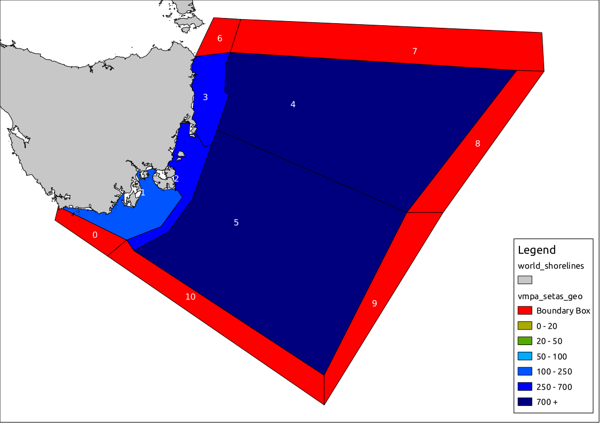

# Atlantis ecosystem model
Software for modelling marine ecosystem including spatial and temporal dynamics
([Asta et al. 201?](https://besjournals.onlinelibrary.wiley.com/journal/2041210x)).
<hr>
<p align="center">
    
</p>
<hr>

# Atlantis model configuration
This page contains the basic instructions for running an Atlantis model on your
computer. For more detailed explanation about the code,  the parameters and many more
you should visit the [Wiki](https://confluence.csiro.au/display/Atlantis/Atlantis+Ecosystem+Model+Home+Page)

 **Attention!**
>If you want a copy of the Atlantis main code (which you will need to start using the
model) you will need to go first to this page
[Atlantis-Wiki](https://confluence.csiro.au/display/Atlantis/CSIRO+licence+and+repository+request)
and sign the
[licence](https://confluence.csiro.au/display/Atlantis/CSIRO+licence+and+repository+request)
agreement and then send an email to the developers, who will give you access to the
code.
___

Atlantis model installation and running
===============
### Index
* [Preparing your machine](#preparing-your-machine)
   * [Linux](#linux)
   * [Windows](#windows)
   * [MacOS](#macos)
* [Check out the code](#checking-out-the-atlantis-code)
* [Building Atlantis](#building-atlantis)
   * [Linux](#linux2)
   * [Windows](#win2)
   * [MacOS](#macos2)
* [Running Atlantis](#running-atlantis)
   * [Linux](#linux3)
   * [Windows](#win3)
   * [MacOS](#macos3)
* [Example Operational Model](#example-operational-model)
   * [Input](#input-files)
   * [Output](#output-files)
   * [Example outputs](#outputs-for-the-setas-model)
* [Supporting software](#supporting-software)

# Preparing your machine
Atlantis requires the following packages and libraries to be installed. This includes
software that operates as: (i) a compiler, (ii) to check out the code (an SVN
platform), and (iii) to a NetCDF file system. Please read the instructions for your
operating system for more details.

**Note**
> If you have questions, visit
[Atlantis-Wiki](https://confluence.csiro.au/pages/viewpage.action?pageId=43155693)

## Linux
####  Checking libraries and packages

* **gcc** - GNU Compiler Collection
* **subversion** - Used to check out the code from the code repository.
* **netcdf** Development library
* **libxml** Development library
* **proj** Development library - used for GIS projections.
* **pkg-config** Can get by without this but it will be easier if you have it.

```
$ dpkg -l | grep build-essential    # Essential packages to build Debian
$ dpkg -l | grep autoconf      	    # Automatic configure script builder
$ dpkg -l | grep subversion         # Version Control System (like GITHUB)
$ dpkg -l | grep gawk          	    # GNU version of Awk
$ dpkg -l | grep proj               # Program Proj.4 Cartographic projection
$ dpkg -l | grep libxml2-dev        # Library for XML language
$ dpkg -l | grep libnetcdf-dev      # Library of development kit for NetCDF
$ dpkg -l | grep flip              	# convert text file line endings between Unix and DOS
```

#### Installing libraries and packages
In the case that you do not have any of the libraries or packages of the previous
point installed, this is the way to install them on your machine.

**Ubuntu**
```
$ sudo apt-get install build-essential
$ sudo apt-get install autoconf
$ sudo apt-get install subversion
$ sudo apt-get install libxml2-dev
$ sudo apt-get install libnetcdf-dev
$ sudo apt-get install gawk
```
**proj4**  install proj.4 following the instruction from developers [webpage](https://proj4.org/)

**Fedora**
```
$ yum install netcdf-devel  # Install the netcdf developer package:
$ yum install subversion    # Install Subversion
$ yum install proj-devel    # Install the proj4 projection package
$ yum install libxml2-devel # Install the libxml developer package
$ yum install automake      # Install automake
$ yum install pkgconfig     # Install pkgconfig
```
*Note*
> Most computers with other versions of Linux, follow similar instructions to install
the necessary packages and libraries. If you have questions, visit
[Wiki-Packages-Linux](https://confluence.csiro.au/display/Atlantis/Building+under+linux)

---
## Windows
#### Compiler:
To build Atlantis you will need to have installed on your machine any of the
following versions of Visual studio:

* Visual Studio C++ 2008
* Visual Studio C++ 2010
* Visual Studio C++ 2012
* Visual Studio C++ Express Edition

<a name="abcde">

You can download all these versions [here](https://visualstudio.microsoft.com/vs/older-downloads/)

Note
>Atlantis will not compile using Visual Studio 2015
#### NetCDF library
Atlantis uses the NetCDF file system. To be able to run Atlantis you will need to
have the NetCDF 4 libraries installed on your computer. Please follow the instructions from the
[developers](https://www.unidata.ucar.edu/software/netcdf/docs/winbin.html) or the
guide provided here
[Atlantis-Wiki](https://confluence.csiro.au/display/Atlantis/NetCDF+4+in+Windows)

#### SVN
To check out the code you will need a svn platform. We support the use TortoiseSVN as
a GUI to check out the code from the code repository. To install the software follow
the instructions from the developer [tortoise](http://tortoisesvn.tigris.org/)
**Note**
>If you want a copy of the Atlantis main code (which you will need to start using the
model) you will need to go first to this page
[Atlantis-Wiki](https://confluence.csiro.au/display/Atlantis/CSIRO+licence+and+repository+request)
and sign the
[licence](https://confluence.csiro.au/display/Atlantis/CSIRO+licence+and+repository+request)
agreement and then send an email to the developers, who will give you access to the
code.

---
## MacOS
##### Important
> We would not recommend using Mac if you have a choice. It generally takes a couple
of hours and as much as a day per machine to set up and Mac is constantly changing
things. Its not as simple as running on windows or Linux and you will need to be
comfortable installing libraries from source.

#### Compiler:
* **Xcode** [site](https://developer.apple.com/xcode/): Compiler (GCC and others). To install Xcode you might download
a dgm file. Once this is downloaded open Finder and drag the Xcode folder into your
applications to install it. Once its finished installing you need to eject it before
you delete it from your downloads folder. Then you might need to type something like
the following:
```
$ sudo xcode-select -switch /Applications/Xcode.app/Contents/Developer
```

* **GCC** : You should use gcc-7, prior to high sierra it was gcc-4.6. You can install this
using [macports](http://www.macports.org/) or [homebrew](http://brew.sh/).

#### Required libraries
Atlantis needs the following libraries to be installed. For each library download the most recent stable versions.

* **autoconf**  Automatic configure script builder. Download using macports.
* **automake** Automatic make script builder. Download using macports.
* **Netcdf** Development library. Install from [source](http://www.unidata.ucar.edu/downloads/netcdf/index.jsp)
* **proj4** Development library, used for GIS projections. Install from [source](http://trac.osgeo.org/proj/). Make sure you get version 4.7.0.
* **pkgconfig** Helper tool used when compiling applications and libraries. Download using macports or from [source](http://www.freedesktop.org/wiki/Software/pkg-config)
* **libxml** - Library to deal with xml files format. Download and installed from [source](http://www.xmlsoft.org/).

All of the following libraries should be downloaded to a folder such as /home/Downloads
To install the library "libname" you should do :
* Unpacked using :
```
$ gzip -dv libname.tar.gz
$ tar -xvf libname.tar
```
* Then cd into the libname dir
```
$ cd libname
```
* Then configure the library and install
```
$ ./configure
$ make
$ sudo make install
```


# Checking out the Atlantis code.

The source code can be accessed through the following URL's:
 * CSIRO users: https://svnserv.csiro.au/svn/atlantis/Atlantis/trunk/atlantis
 * External Partners: https://svnserv.csiro.au/svn/ext/atlantis/Atlantis/trunk/atlantis

If you need information on how to check out the code from SVN have a look at this
tutorial - [SVN](http://vegastrike.sourceforge.net/wiki/HowTo:Checkout_SVN)

#### Linux
```
$ svn co https://svnserv.csiro.au/svn/ext/atlantis/Atlantis/trunk/atlantis
```
#### Windows and MacOS
To locally compile the code, create a new folder or checkout directory for your
source code (e.g. c:\Code\atlantis). Right click in this new folder and select the
new menu option  **"SVN checkout"**  and enter the appropriate URL into the *"URL"* of the
repository field’.


Note
> Remember that if you want a copy of the Atlantis main code you will need to go
first to this page
[Atlantis-Page](https://confluence.csiro.au/display/Atlantis/CSIRO+licence+and+repository+request)
and sign the
[licence](https://confluence.csiro.au/display/Atlantis/CSIRO+licence+and+repository+request)
agreement and then send an email to the developers, who will give you access to the
code.

# Building Atlantis
___
<a name="linux2">

## Linux
#### Linux Versions
So far we have built Atlantis on the following platforms:
* Ubuntu
* Fedora
* CentOS
* Debian 7.2
* Wheezy 64

If you want a choice which flavor to use we recommend 64-bit Ubuntu.

###### Instruction to build Atlantis under Ubuntu and Fedora.
```
$ cd  /to/your/atlantis/trunk/folder/
$ aclocal
$ autoconf
$ automake -a               # If you have problems with this section
$ autoreconf  -fvi          # you can use this command instead.
$ sudo chmod +x configure   # Change the permissions to the configure script
$ ./configure
$ make
$ sudo make install
```
To build Atlantis in another versions of Linux please visit the
[Wiki-Building-Atlantis](https://confluence.csiro.au/display/Atlantis/Building+under+linux).
___
<a name="win2">

## Windows

Building in Visual Studio requires opening the appropriate visual studio solution in
the root Atlantis SVN repository folder.
* Visual Studio 2008 uses atlantis_VS2008.sln
* Visual Studio 2010 uses atlantis_VS2010.sln
* Visual Studio 2012 uses atlantis_VS2012.sln

If you have questions related visit [Wiki-Packages-Windows](https://confluence.csiro.au/display/Atlantis/Building+under+windows)

Code:
>Due to licensing requirements, new users must register to access the
code. If you want a copy of the Atlantis main code (which you will need to start using the
model) you will need to go first to this page
[Atlantis-Wiki](https://confluence.csiro.au/display/Atlantis/Atlantis+Ecosystem+Model+Home+Page)
and sign the
[licence](https://confluence.csiro.au/display/Atlantis/CSIRO+licence+and+repository+request)
agreement and then send an email to the developers. Registration gives access to the
code and
[Atlantis-Wiki](https://confluence.csiro.au/display/Atlantis/Atlantis+Ecosystem+Model+Home+Page)
site, which has the latest updates about code modifications, code repository and examples of input and
output files with expected types and values for model parameters.

___
<a name="macos2">

## MacOS
Initially,  to include all the source code (or the new added) you will need to build
the code via command line rather than using other developer software (e.g. eclipse ).
In the Atlantis code there is a file called *configure_mac*,  you will probably need
to edit this file to point to each of the locations of the libraries you have
installed. In the following instructions substitute  *configure_N* with the name of
the custom *configure_mac* file you have created.

#### Building from the source code
Open a terminal and go to where your source code is and type:
```
$ aclocal
$ autoheader
$ autoconf
$ automake -a
$ ./configure_N
make
```
This will hopefully build an executable called atlantisNew in the atlantismain
folder. If it doesn't work you will probably need to edit the configure_N script you
have created to point to the correct folders or check the libraries are correctly
installed.

```
$ sudo make install
```
This will install the Atlantis header files and the executable in /usr/local/include/Atlantis-1.0/Atlantis and /usr/local/bin

more detailed information bout how to build Atlantis can be found in the [Atlantis-Wiki](https://confluence.csiro.au/display/Atlantis/Building+under+mac)

# Running Atlantis
<a name="linux3">

## Linux or MacOS
 1. [Compile Atlantis](#linux2)
 2. Create the bash application program file (**.sh**)
 - Open your plain text editor, such as gedit, emacs or nano. (e.g. *runAtlantis.sh*)
 - Add the commands to run Atlantis, which should have the following fortat:

   If Your are using Ubuntu
   ```
   #!/bin/bash
   atlantisMerged -i in.nc 0 -o output.nc -r run.prm -f force.prm -p physics.prm -b biol.prm -h harvest.prm -a assess.prm -e economics.prm -s functionalGroups.csv -d outputFolder
   ```
   If Your are using MacOS
   ```
   #!/bin/bash
   atlantis -i in.nc 0 -o output.nc -r run.prm -f force.prm -p physics.prm -b biol.prm -h harvest.prm -a assess.prm -e economics.prm -s functionalGroups.csv -d outputFolder
   ```
 3. Open the terminal window, navigate to your model run
 directory that has the  **.sh**  file in it (and your Atlantis model), type the name of your
 **.sh** file and press ENTER.
   ```
   user@pc:~$
   user@pc:~$ cd Atlantis/run
   user@pc:~/Atlantis/run>  ./runAtlantis.sh
   ```

<a name="win3">

## Windows
 1. [Compile Atlantis](#win2)
 2. Create the batch file (**.bat**)
 - Open your plain text editor, such as a Notepad or WordPad document. (e.g. *runAtlantis.bat*)
 - Add the commands to run Atlantis, which should have the following format:
   ```
   atlantis -i in.nc 0 -o output.nc -r run.prm -f force.prm -p physics.prm -b biol.prm -h harvest.prm -a assess.prm -e economics.prm -s functionalGroups.csv -d outputFolder
   ```
 3. Open the dos command prompt window, navigate to your model run
 directory that has the BAT files in it (and the  *.exe*  file if you have not
 formally installed Atlantis to the command line paths), type the name of your BAT
 file and press ENTER.
 ```
 C:\> cd Atlantis\run
 C:\Atlantis\run$  runAtlantis.bat
 ```
# Example Operational Model
The best way to learn is to play with an existing operational model.
The most used model example is the South East Tasmania (SETas) Atlantis model. This
 model is divided into 8 polygons and has 5 water layers and one sediment layer. It
 has 35 functional groups of which 9 are groups structured by size, 23 are pool
 biomass and three are detritus. This model also includes a hydrodynamic model that
 represent the flows between boxes, also includes forcing of salinity, temperature,
 fish catches, and arsenic concentration.

<p align="center">
    
</p>

## Input files
Brief description of all the input files required to run an Atlantis model. See the
Atlantis manual
([part 1](https://confluence.csiro.au/display/Atlantis/Atlantis+Documentation?preview=/43155557/397385419/AtlantisUserGuide_PartI.pdf)
and
[part 2](https://confluence.csiro.au/display/Atlantis/Atlantis+Documentation?preview=/43155557/397385421/AtlantisUserGuide_PartII.pdf))
or [Atlantis-wiki](https://confluence.csiro.au/display/Atlantis/Atlantis+Ecosystem+Model+Home+Page) for more details.
> All the files can be downloaded [here](https://github.com/jporobicg/SETas_Exc/archive/master.zip)
### Basic files
* [**Group.csv**](https://github.com/jporobicg/SETas_Exc/blob/master/SETasGroupsDem.csv) A file containing information about the functional groups in the model.
* [**XXX.bgm**](https://github.com/jporobicg/SETas_Exc/blob/master/VMPA_setas.bgm) The file defines the geography used in the Atlantis model to define the bathymetry of the model system.
* [**run.prm**](https://github.com/jporobicg/SETas_Exc/blob/master/VMPA_setas_run_fishing_F_Trunk.prm) A file storing all the parameters defining the run setup (timestep, run and stop times, etc.)
* [**physics.prm**](https://github.com/jporobicg/SETas_Exc/blob/master/VMPA_setas_physics.prm) Physics parameters (coefficients) - apart from setting some flags (e.g. turning resuspension on/off), point-source scaling and quarterly eddy strength distribution these parameters are not typically changed.
* [**force.prm**](https://github.com/jporobicg/SETas_Exc/blob/master/VMPA_setas_force_fish_Trunk.prm) A file that lays out the forcing file pathways for hydrodynamics, point sources, climate time series (precipitation, irradiance, temperature and salinity), historical catch, fuel prices, GDP and complex spatial zonation.
* [**biol.prm**](https://github.com/jporobicg/SETas_Exc/blob/master/VMPA_setas_biol_fishing_Trunk.prm) File detailing all the ecological parameters, submodel selection, network connection definitions and quarterly distributions.
* **in.nc** A NetCDF file where the initial conditions of the model are given, such as the initial biomass and size values for each functional group and age structure.
### Additional files
* **assess.prm** File detailing the sample design, sampling error structures and basic assessment model parameters.
* [**harvest.prm**](https://github.com/jporobicg/SETas_Exc/blob/master/harvest_stripped.prm) File storing all the fisheries and management parameters and submodel definitions.
* **econ.prm** A file storing all the socio-economics parameters (for the market model, trading model, and black-book based effort allocation model).
* **XXX.ts** Time-series files used to force the model with N data columns and a reference year.

## Output files
### NetCDF output Files
Atlantis generates a number of NetCDF output files that contain spatial information
such as the biomass of functional groups in boxes and layers.  The NetCDF files do
not follow the normal gridded NetCDF structure that people are used to as the
Atlantis model is a box model, not a grid model. The normal packages such as
[ncview](http://meteora.ucsd.edu/~pierce/ncview_home_page.html) will not work with
Atlantis output NetCDF files. To read these outputs you can use your own code or one
of the tools developed for these type of outputs [Tools](#supporting-software).
*  **biol.nc**
This 3D (time, box, layer) contains snapshots of the tracers in the model at given time frequencies in each box and layer.
*  **biolTOT.nc**
This 2D (time, box) output file contains a sum of the tracer values in each box.
*  **biolPROD.nc**
This output file is useful during the model tuning process and contains 2D data (time, box) for each box. It contains the tracers for production and grazing for invertebrate groups, growth and consumption for each age class for each vertebrate group, and a number of indices such as the diversity index.
*  **CATCH.nc**
This output file contains cumulative values of:
   * Catch per species per age class (cohort) in numbers
   * Discards per species per age class (cohort) in numbers
   * Catch per species per fishery (in tonnes) - that is the total tonnes taken from that box
   * Discards per species per fishery (in tonnes) - that is the total tonnes taken from that box

*Note*
> To convert the numbers to biomass you have to multiple by individual size-at-age
(form biol.nc) and then * X_CN * mg_2_tonne where X_CN is the Redfield ratio
specified in the biol.prm file (typically 5.7) and mg_2_tonne is 0.00000002
*  **TOTCATCH.nc**
This output files also contains cumulative values in tonnes. All values are zeroed after they are written out. Tracers include:
   * Total catch per species
   * Total recreational catch per species
   * Total discards per species.
*  **ANNAGEBIO.nc**
This output provides abundance in each annual age class (Numbers at age per species)

*Note*
> So mapped from Atlantis "age class" which can contain multiple years to true annual
age classes).

*  **ANNAGECATCH.nc**
This output provides numbers at annual age class in the catch and discards (summed
over all fleets). Tracers provided are:
   * Numbers at age per species in the catch
   * Numbers at age per species in the discards

### Plain text files
these files can contains a simplified or aggregate version of the information
contained in the NetCDF Files or and specific output.
##### Biologically relevant output:
*  **BiomIndx.txt**
Biomass in tonnes of each species across the entire model domain
*  **DietCheck.txt**
Indication of diet pressure
*  **DetailedDietCheck.txt**
This file is only produced if flagdietcheck is set to 1. The file produced provides the total biomass consumed of each prey species per age class of each predator species per box and layer. 
*  **YOY.txt**
This is the biomass in tonnes per spawning event summed over the total model domain.
##### Catch and fisheries relevant output
*  **BrokenStick.txt**
The output file that has been created to debug the broken stick management strategy.
*  **Catch.txt**
The total landings per species (in tonnes) across the entire model domain (summed over fisheries)
*  **CatchPerFishery.txt**
The catch of each species per fishery (in tonnes) across the entire model domain (summed over fisheries)
*  **Discards.txt**
The total discards per species across the entire model domain (summed over fisheries)
*  **DiscardsPerFishery.txt**
The discards of each species per fishery across the entire model domain (summed over fisheries)
## Outputs for the SETas model
### Trophic relationship between functional groups

### Biomass dynamics by age class for a specific functional group (Small demersal fish)

### Dynamics of total functional group's predation

### Predation by Age class

<hr>

# Supporting software

* [Atlantistools](https://github.com/alketh/atlantistools): Is a data processing and visualization tool for R, which helps to
process output from Atlantis models within R. Using atlantistools makes sure that
Atlantis users use the same input/output file structure which facilitates intra and
inter model comparisons.

* [Shiny R Atlantis](https://github.com/Atlantis-Ecosystem-Model/shinyrAtlantis): An
r-based shiny package that can be used to visually assess parameter values and
initial conditions of an Atlantis model.

* [Reactive Atlantis](https://github.com/Atlantis-Ecosystem-Model/ReactiveAtlantis):
Reactive Atlantis has several tools that were created to help in the tuning,
parametrization and analysis of the processes and parameters most often modified
during the calibration of Atlantis.

* [rbgm](https://github.com/AustralianAntarcticDivision/rbgm): Allows reading of
  geometry from BGM files, either in raw coordinate form or as Spatial objects.

* [angstroms](https://github.com/AustralianAntarcticDivision/angstroms): The goal of
  angstroms is to provide easy access to Regional Ocean Modeling System (ROMS) output
  for R.
